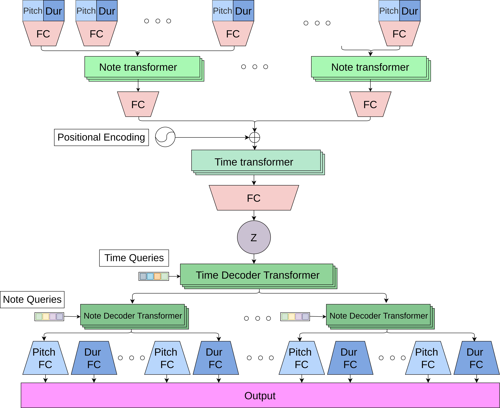

# PianoTreeMer VAE

This repository derived by modifying original [PianoTree VAE](https://github.com/ZZWaang/PianoTree-VAE) model and code. 

## Requirements

`$ pip install numpy torch tqdm tensorboardx matplotlib`

## Training

Adapt `train.py` to work with 32 or 128 time steps. 

`model.py` is the original PianoTree VAE that uses GRU blocks. `model_tr_full_ultra.py` is the full transformer VAE model designed for 32 time steps. `model_tr_full_ultra_plus.py` adapted version to work with 128 time steps.

## Testing

Download weights from [here](https://mbzuaiac-my.sharepoint.com/:f:/g/personal/rikhat_akizhanov_mbzuai_ac_ae/Eucr-atGw4ZHl06A6FsGbckB6ESfbTaVFs8ldHdzRtF4VA?e=MLxxfr), and put them in `./runs` folder.

See `test.ipynb` for 32 steps model inference, and `test_128.ipynb` for 128 respectively. 

## Model

